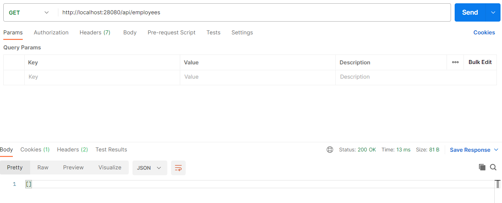
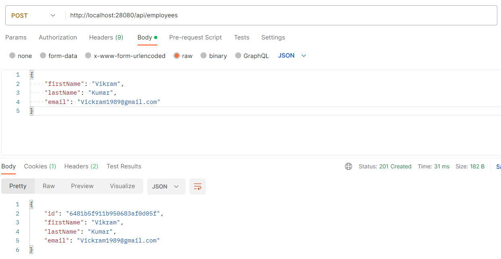
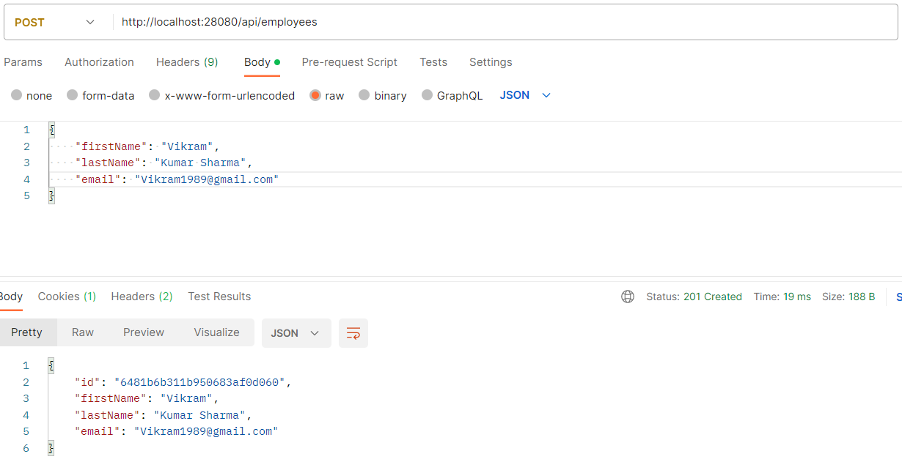
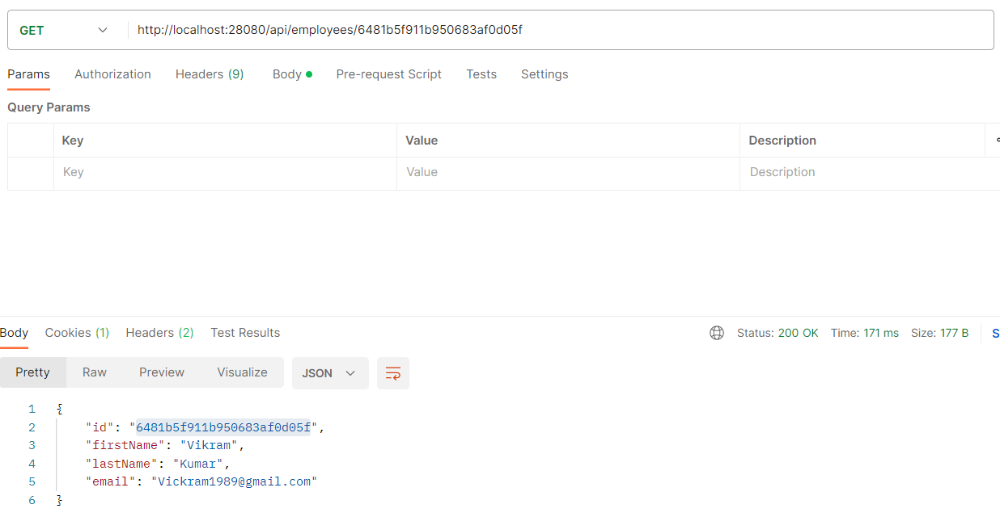
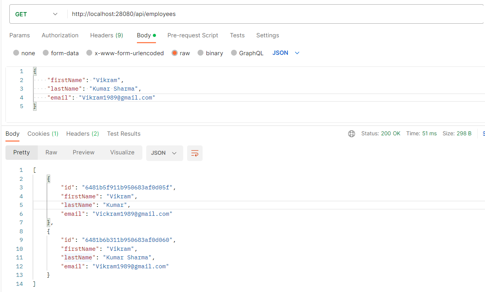
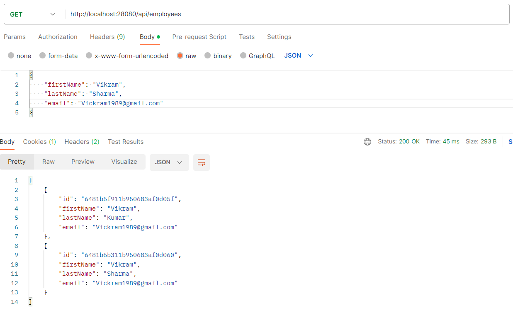
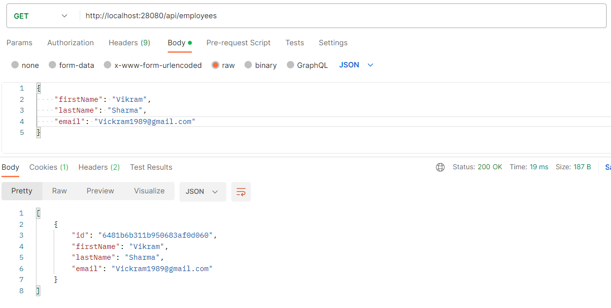

# this is basic spring-webflux-mongodb example.
# steps to execute this application:
    # from postman execute following api's:
        GET: http://localhost:28080/api/employees
            
        
        POST: http://localhost:28080/api/employees
            
            
            
        GET: http://localhost:28080/api/employees
            
            
            

        PUT: http://localhost:28080/api/employees/6481b6b311b950683af0d060
            

        GET: http://localhost:28080/api/employees
            

        DELETE: http://localhost:28080/api/employees/6481b5f911b950683af0d05f
        
        GET: http://localhost:28080/api/employees
            

        
        
        
            
        